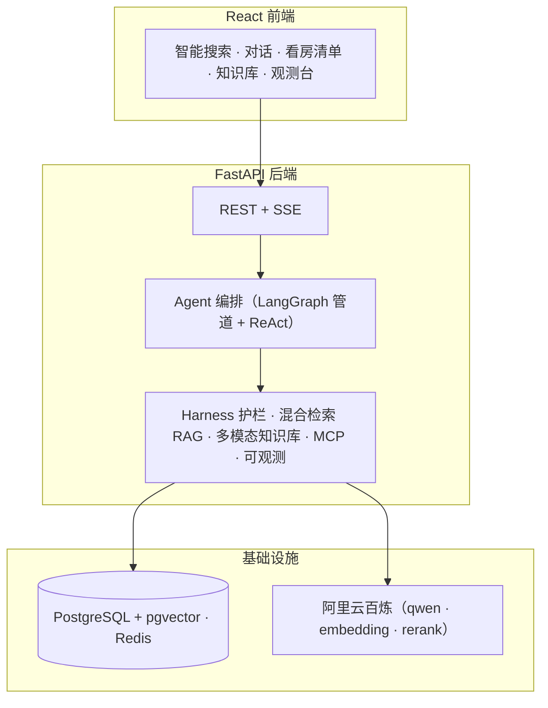

<p align="center">
  <h1 align="center">🏠 RentAI</h1>
  <p align="center">AI Agent 驱动的智能租房助手 —— 把「翻平台 + 手动比价 + 怕被坑」压缩成一次自然语言输入、一份可执行的看房清单</p>
  <p align="center">
    
    
    
    
    
    
    
    
  </p>
</p>

> **企业级工程标准**的 C 端生活化 AI Agent 项目（秋招面试项目，作者 zcy）。生活场景有共鸣，工程硬度有区分度——确定性管道与模型自主决策双轨、自研 Harness 治理、评测体系与独立观测后台、多租户 / 鉴权 / 审计 / 可部署。

---

## ✨ 特性

- **🗣️ 对话式 Agent**：多轮自然语言意图解析 → 澄清 → 执行；短期会话记忆 + 长期用户画像（Redis 持久化，前端 history 作上下文真相源，跨刷新可续）
- **🤖 ReAct 自主决策**：模型通过 function calling 自主决定调用哪些工具、顺序与步数，并反思自纠错；确定性管道（LangGraph）作可复现的兜底与基准对照
- **🛡️ 自研 Harness 治理层**：输入越界护栏、死循环护栏、候选截断防上下文膨胀、引用约束防幻觉（对位 DeepSeek Harness：Agent = Model + Harness）
- **🔍 混合检索 RAG + pgvector**：关键词 ∪ 语义召回 → gte-rerank 重排；多平台房源可插拔（贝壳真实 + 合成/mock）
- **📚 多模态文档知识库**：上传 PDF / PPT / Excel 解析入库，检索带来源/页码引用（可溯源、防幻觉）
- **✅ 看房清单 HITL**：人工确认 / 调整闭环，PG 持久化，确认结果并入用户画像，让每个动作有业务含义
- **📊 评测体系 + 观测后台**：确定性匹配指标 + Agent 决策质量 + Ragas 语义指标（现成库，不自研）；独立观测台页面实时看对话用量与数据基线
- **🔐 企业级工程**：JWT + RBAC + 多租户隔离、MCP 工具暴露、SSE 流式、Docker Compose 一键部署

---

## 🏗️ 架构总览



**核心设计**：把「可复现的确定性流水线」和「模型自主决策」分开（双轨）——确定性链路稳定可控、可评测，ReAct 链路体现 Agent 自主性；几百条房源放在共享 `AgentCtx`，工具只返回摘要给模型观察，模型负责决策、确定性函数负责执行（省 token）。

---

## 🧰 技术栈

| 层 | 选型 |
|---|---|
| 后端 | Python 3.12 · FastAPI · Pydantic v2 · Uvicorn |
| Agent 编排 | LangGraph StateGraph（确定性管道）· LangChain ReAct · 自研 Harness |
| LLM | 阿里云百炼：qwen-plus / text-embedding-v4 / gte-rerank |
| RAG | 混合检索（关键词 ∪ pgvector 语义）→ 重排 · 多模态文档知识库 |
| 存储 | PostgreSQL + pgvector · Redis · MinIO |
| 协议 | MCP（FastMCP）· Function Calling · SSE |
| 前端 | React 18 · Vite 6 · TypeScript · Zustand · Tailwind · react-router |
| 工程 | Docker Compose · pytest · JWT/RBAC · Alembic 迁移 · 观测后台 |

---

## 🚀 快速开始

### 1. 克隆 & 配置密钥

```bash
git clone <your-repo-url> rentai && cd rentai
cp backend/.env.example backend/.env   # 填入你自己的密钥（绝不提交真实 key）
```

`backend/.env` 需配置（示例见 `backend/.env.example`）：

```ini
# 阿里云百炼
DASHSCOPE_API_KEY=sk-你的百炼APIKey
DASHSCOPE_BASE_URL=https://dashscope.aliyuncs.com/compatible-mode/v1
CHAT_MODEL=qwen-plus
EMBEDDING_MODEL=text-embedding-v4
RERANK_MODEL=gte-rerank
# 高德开放平台
AMAP_KEY=你的高德Web服务Key
```

> 🔒 所有密钥仅存于 `backend/.env`，已被 `.gitignore` 排除，**不会提交到仓库**。

### 2. 一键启动（Docker Compose）

```bash
docker compose up -d
# 前端: http://localhost:5173   后端 API: http://localhost:8000
```

三个容器自动就绪：`rentai-postgres`(pgvector) + `rentai-redis` + `rentai-backend`。

### 3. 本地开发（可选）

```bash
# 后端
cd backend && uv sync && uv run uvicorn app.main:app --reload --port 8000
# 前端
cd frontend && npm install && npm run dev
```

---

## 🧪 评测与观测

| 层次 | 对象 | 指标 |
|---|---|---|
| ① 结果质量（确定性） | 检索→过滤→排序→避坑→清单管道 | match_precision@k / match_recall / risk_recall |
| ② Agent 决策质量 | ReAct 自主调工具轨迹 | avg_decision_score（覆盖/顺序/无重复/尊重指令） |
| ③ 语义指标（Ragas） | RAG 答案质量 | faithfulness / context_precision（现成库 ragas，不自研） |
| ④ 机制自检 | 评测脚本本身 | 指标区间 + 同源自洽 = 1.0 |

独立观测后台（`/observe`）：确定性评测 + 对话用量（token / 延迟 / 成本）+ 数据基线，实时自动刷新。

```bash
curl http://localhost:8000/api/rent/observe/metrics
curl "http://localhost:8000/api/rent/observe/ragas?limit=3"   # 语义评测（慢，调 LLM）
```

---

## 📁 目录结构

```
rentai/
├─ backend/
│  ├─ app/
│  │  ├─ api/            # REST/SSE 路由 + JWT/RBAC
│  │  ├─ agents/         # LangGraph 管道 / ReAct / 对话式 / 反思
│  │  ├─ rag/            # 混合检索 + pgvector
│  │  ├─ doc_knowledge/  # 多模态文档知识库
│  │  ├─ tools/          # 数据源 / 通勤 / ReAct 工具 / MCP
│  │  ├─ llm/            # 百炼网关 / embedding / rerank
│  │  ├─ core/           # 配置 / Harness 护栏 / 鉴权
│  │  ├─ services/       # 看房清单持久化
│  │  └─ observability.py
│  ├─ evals/             # 评测脚本（确定性 / 决策 / Ragas）
│  └─ alembic/           # 迁移
├─ frontend/src/         # React 页面 + 组件 + 状态 + api 封装
├─ docs/                 # 开发文档（可溯源）
└─ docker-compose.yml    # postgres + redis + backend 一键部署
```

---

## 📚 文档

- [`docs/部署文档.md`](docs/部署文档.md)：Docker Compose 一键部署、密钥配置、常用命令与 FAQ

---

## 📝 License

[MIT](LICENSE) —— 个人秋招面试项目，仅用于学习交流。
