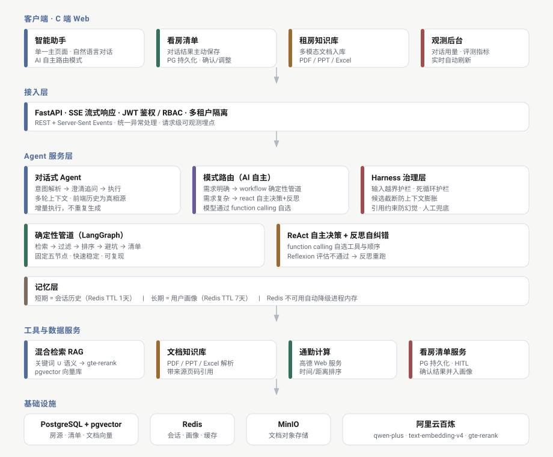

<p align="center">
  <h1 align="center">RentAI</h1>
  <p align="center">AI Agent 驱动的智能租房助手 —— 把翻平台、手动比价、怕被坑压缩成一次自然语言输入、一份可执行的看房清单</p>
  <p align="center">
    
    
    
    
    
    
    
    
  </p>
</p>

---

## 特性

- 单一对话主页面：所有操作收敛到一个自然语言对话框，AI 自主判断是闲聊、澄清追问还是执行找房
- AI 自主模式路由：模型通过 function calling 自主选择执行模式，需求明确走确定性管道，需求复杂走 ReAct 自主决策
- 三层记忆架构：工作记忆依托 LangGraph State，短期记忆持久化至 PostgreSQL 按会话隔离，长期记忆结构化存储用户偏好跨会话共享，Redis 作为热缓存加速读取
- 看房清单持久化：对话返回候选房源后一键保存为看房清单，PostgreSQL 持久化，刷新与换设备均不丢失
- 混合检索 RAG：BM25 关键词检索与 pgvector 余弦相似度语义检索双路召回，gte-rerank 重排模型精细化排序
- 多模态文档知识库：支持 PDF、PPT、Excel 文档解析入库，检索带来源引用
- 结构化风险规则引擎：六类租房风险编码为可检索条目，检索时为房源附加带引用依据的风险标注
- 可观测性与自动评测：装饰器埋点采集运行指标，三十四标注用例评测集自动化对比，Ragas 语义评测框架集成
- 企业级工程：JWT 鉴权、多租户数据隔离、SSE 流式输出、Docker Compose 一键部署

---

## 架构总览



所有交互收敛到单一对话主页面。AI 每轮做意图解析，自主决定是闲聊回复、澄清追问还是执行找房。执行时模型自主选择确定性管道或 ReAct 自主决策。候选房源放在共享上下文，工具只返回摘要给模型观察，模型负责决策、确定性函数负责执行。

---

## 技术栈

| 层 | 选型 |
|---|---|
| 后端 | Python 3.12、FastAPI、Pydantic v2、Uvicorn |
| Agent 编排 | LangGraph StateGraph、LangChain ReAct |
| LLM | Qwen-Plus、text-embedding-v4、gte-rerank |
| RAG | 混合检索、重排、多模态文档知识库 |
| 存储 | PostgreSQL + pgvector、Redis |
| 协议 | Function Calling、SSE |
| 前端 | React 18、Vite 6、TypeScript、Zustand、Tailwind、react-router |
| 工程 | Docker Compose、JWT、多租户隔离、观测后台 |

---

## 快速开始

### 1. 克隆与配置密钥

```bash
git clone https://github.com/zcy-hhh/rentai.git
cd rentai
cp backend/.env.example backend/.env
```

backend/.env 需配置：

```ini
DASHSCOPE_API_KEY=sk-你的百炼APIKey
DASHSCOPE_BASE_URL=https://dashscope.aliyuncs.com/compatible-mode/v1
CHAT_MODEL=qwen-plus
EMBEDDING_MODEL=text-embedding-v4
RERANK_MODEL=gte-rerank
AMAP_KEY=你的高德Web服务Key
```

所有密钥仅存于 backend/.env，已被 .gitignore 排除，不会提交到仓库。

### 2. 一键启动

```bash
docker compose up -d
```

前端：http://localhost:5173
后端 API：http://localhost:8000

三个容器自动就绪：rentai-postgres(pgvector)、rentai-redis、rentai-backend。

### 3. 本地开发

```bash
cd backend && uv sync && uv run uvicorn app.main:app --reload --port 8000
cd frontend && npm install && npm run dev
```

---

## 评测与观测

| 层次 | 对象 | 指标 |
|---|---|---|
| 结果质量 | 检索到过滤到排序到避坑到清单管道 | 匹配精确率、匹配召回率、避坑召回率 |
| Agent 决策质量 | ReAct 自主调工具轨迹 | 决策准确率 |
| 语义指标 | RAG 答案质量 | Ragas 语义评测 |

独立观测后台展示对话轮次、Token 消耗、响应延迟、估算成本等运行指标。

```bash
curl http://localhost:8000/api/rent/observe/metrics
```

---

## 目录结构

```
rentai/
├─ backend/
│  ├─ app/
│  │  ├─ api/            # REST/SSE 路由、JWT 鉴权、看房清单端点
│  │  ├─ agents/         # 对话式 Agent、LangGraph 管道、ReAct、反思
│  │  ├─ rag/            # 混合检索、pgvector、风险规则引擎
│  │  ├─ doc_knowledge/  # 多模态文档知识库
│  │  ├─ tools/          # 数据源、通勤、ReAct 工具
│  │  ├─ llm/            # 百炼网关、embedding、rerank
│  │  ├─ core/           # 配置、护栏、鉴权
│  │  ├─ memory/         # 三层记忆系统
│  │  ├─ services/       # 看房清单持久化
│  │  └─ observability.py # 请求级指标收集
│  ├─ evals/             # 评测脚本
│  └─ alembic/           # 数据库迁移
├─ frontend/src/
│  ├─ pages/             # Chat 主页面、Viewing、Knowledge、Observe
│  ├─ components/        # 布局、候选房源卡片、保存清单按钮
│  ├─ store/             # Zustand 状态管理
│  └─ api.ts             # 后端 API 封装
├─ docs/
│  ├─ architecture.svg   # 架构图
│  └─ 部署文档.md         # Docker Compose 部署指南
└─ docker-compose.yml     # postgres(pgvector) + redis + backend 一键部署
```

---

## 文档

- docs/部署文档.md：Docker Compose 一键部署、密钥配置、常用命令与 FAQ

---

## License

MIT —— 仅供学习交流使用。
